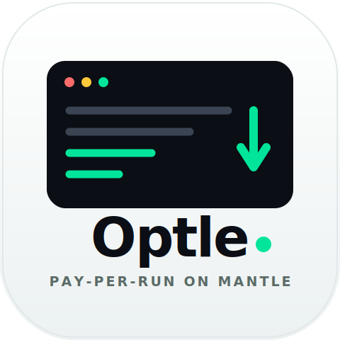

<p align="center">
  
</p>

# Optle — pay-per-run gas optimization for Solidity

**Optle turns gas optimization into a one-shot, onchain-paid service.** Upload a
Foundry project, pay per run in **native MNT** on **Mantle**, and get back a
**deployable, test-verified optimized build** — with a per-file diff and a
measured before/after gas report.

What makes it more than an LLM wrapper:

- ⛓️ **Verified, not guessed.** Every change is re-checked against the project's
  own `forge` tests + a gas snapshot. A change that breaks a test or doesn't
  reduce gas is discarded — so outputs are correct and safe by construction.
- 💸 **Pay-per-run, no accounts.** An HTTP-402 challenge gates each run: the wallet
  sends a native **MNT** transfer to the server's address and the server verifies
  that transaction on-chain (via RPC) before the job starts. The same endpoint a
  human pays through can be called by an agent or CI.
- 📦 **Deployable output.** Optimized code lands in a separate `optimized/`
  directory (originals untouched) with a GitHub-style diff you can review.

## Flow

```
Upload .zip → Pay (native MNT) → Isolated container: snapshot → optimize → forge verify → re-measure → Download optimized build
```

## Tencent Cloud × Mantle integration

The whole loop runs on Tencent Cloud and settles on Mantle:

| Layer | Role |
|---|---|
| **Mantle Sepolia** | Payment rail. Pay-per-run in **native MNT**: an HTTP-402 challenge asks the wallet for a tier-priced MNT transfer to the server's address, and the server verifies that transaction **on-chain via Mantle RPC** (mined, successful, correct recipient & amount) before the run starts. Wallet + balance via Mantle RPC. |
| **Tencent Cloud CVM** | Runs the API server and spawns a fresh **isolated Docker runner** per job (`--network none`, CPU/mem/pid limits) so untrusted uploaded code never touches the host. |
| **Tencent Cloud COS** | Object storage for each job's `input.zip` / `output.zip`; the optimized build is delivered via a short-lived **presigned URL**. |

## Optimization quality & safety

The agent loads the [`solidity-gas-optimizer`](skills/gas-optimizer/SKILL.md)
skill — a curated pattern corpus distilled from **Solady, Uniswap v3/v4, and
Cyfrin Solodit** gas findings, not generic prompting. It works at two depths:

| Level | Scope |
|---|---|
| **1** | Function-body only — cache SLOADs, custom errors, `unchecked`, `constant`/`immutable`, `public`→`external`, `calldata`. Storage layout unchanged. |
| **2** | L1 **+** storage redesign — struct/slot packing, bitmaps, smaller types. New-deployment only. |

**Safety is enforced, not promised.** The optimizer never weakens a check; it
preserves the external interface (signatures, events, return shapes); and a
mandatory verification gate **reverts any edit** that fails the tests or doesn't
measurably reduce gas. Trade-offs that audits flag (e.g. downsizing a stored sum)
are gated behind the test suite.

## Verifiable & reproducible — not a black box

Savings are **measured with Foundry**, and you can reproduce them yourself. The
repo ships [`examples/staking-demo`](examples/staking-demo) — two intentionally
inefficient contracts with **25 passing tests** — and every result includes the
optimized build plus an `OPTIMIZATION_REPORT.md`. To independently verify:

```bash
# baseline
forge test --gas-report
# optimized build (shipped in the result zip, with its own runnable foundry setup)
cd optimized && forge test --gas-report     # same tests pass, lower gas
```

Because the optimized variant carries its own mirror test setup, anyone can re-run
the exact before/after comparison — no trust required.

## Fits real developer workflows

- **Humans:** drop a `.zip`, pay, download — a deployable build, no local agent or
  API keys.
- **Agents / CI:** the 402-gated HTTP endpoint is account-less and machine-native;
  a bot or pipeline can pay-and-optimize the same way the UI does.
- **Mantle builders:** lowers the barrier to shipping cheaper contracts without
  hand-auditing every SLOAD.

Pricing scales with project size (from the uploaded `.zip`): **0.01 / 0.05 / 0.2
MNT** (small / medium / large), injected into the 402 challenge per job.

## Demo

A landing page (`/`) and the app (`/app`, step-based: upload & pay → optimize →
result). **"Load sample"** runs the bundled demo project end-to-end without
picking a file — and with `OPTLE_ENGINE=mock` the full payment + pipeline flow is
free and instant for live demos. The real engine (Claude Agent SDK) is one env
var away.

## Repository

```
apps/web/          React + wagmi/viem/RainbowKit (landing + step-based app)
apps/server/       Express 402 gate + on-chain payment verify: /upload, /optimize/:jobId, /status, /download
apps/runner/       Isolated optimizer image (Foundry + Node + Claude Agent SDK)
skills/            gas-optimizer skill (SKILL.md + pattern corpus)
examples/          staking-demo — reproducible benchmark project (25 tests)
```

## Run it

```bash
cd apps/web && npm install && npm run dev   # http://localhost:5173
```

The dev server proxies `/api` to a backend (`DEV_API_TARGET`, default localhost).
The backend address is never hardcoded — configure via env (`VITE_API_BASE` for
the deployed frontend, `API_DOMAIN` for Caddy, `OPTLE_ENGINE` for mock vs Claude,
`OPTLE_VERIFY=off` for a fast no-Foundry-loop pass). Each app has a `.env.example`;
full instructions in [DEPLOY.md](DEPLOY.md).

## Tech

Solidity / Foundry · HTTP-402 pay-per-run · native MNT · Mantle Sepolia · Tencent
Cloud (CVM + COS) · Caddy · Docker · Node/TypeScript/Express · viem · React/Vite ·
wagmi + RainbowKit · Claude Agent SDK · Netlify.

> Testnet-only hackathon build: keys are testnet-only and live in gitignored
> `.env` files; job state is in-memory; no auth/rate-limiting. Not for mainnet as-is.
